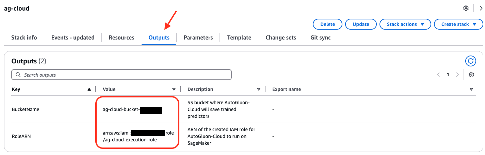

# Train and Deploy AutoGluon Models on Amazon SageMaker with AutoGluon-Cloud

To help with AutoGluon models training, AWS developed a set of training and inference [deep learning containers](https://github.com/aws/deep-learning-containers/blob/master/available_images.md#autogluon-training-containers).
The containers can be used to train models with CPU and GPU instances and deployed as a SageMaker endpoint or used as a batch transform job.

We offer the [autogluon.cloud](https://github.com/autogluon/autogluon-cloud) module to utilize those containers and [Amazon SageMaker](https://aws.amazon.com/sagemaker/) underneath to train/deploy AutoGluon backed models with simple APIs.

```{attention}
Costs for running cloud compute are managed by Amazon SageMaker, and storage costs are managed by AWS S3. AutoGluon-Cloud is a wrapper to these services at no additional charge. While AutoGluon-Cloud makes an effort to simplify the usage of these services, it is ultimately the user's responsibility to monitor compute usage within their account to avoid unexpected charges.
```


## Installation
`autogluon.cloud` does not come with the default `autogluon` installation. You can install it via:

```bash
pip install autogluon.cloud
```

Also ensure that the latest version of sagemaker python API is installed via:

```bash
pip install -U sagemaker
```

This is required to ensure the information about newly released containers is available.

## Prepare an AWS Role with Necessary Permissions
Currently, AutoGluon-Cloud can use two cloud backends: **Amazon SageMaker** and **Ray (AWS)**.
Here is an overview of the features supported by each backend.

| Feature                        | SageMaker | Ray (AWS) |
|--------------------------------|---------------|--------------|
| **Supported modalities**       | `tabular`, `timeseries`, `multimodal` | `tabular` |
| **Training (single instance)** | ✅ | ✅ |
| **Training (distributed)**     | ❌ | ✅ |
| **Inference endpoints**        | ✅ | ❌ |
| **Batch inference**            | ✅ | ❌ |

AutoGluon-Cloud needs to interact with various AWS resources. For this purpose, we recommend to set up a dedicated IAM role with the necessary permissions. This can be done using one of the following options.

::::{tab-set}
:::{tab-item} CloudFormation (AWS CLI)
:sync: setup-cli
1. Download and review the CloudFormation template from the [AutoGluon-Cloud repository](https://github.com/shchur/autogluon-cloud/tree/add-cfn-templates/cloudformation)
    ```bash
    BACKEND="sagemaker"  # Supported options "sagemaker", "ray_aws"
    wget https://raw.githubusercontent.com/shchur/autogluon-cloud/refs/heads/add-cfn-templates/cloudformation/ag_cloud_$BACKEND.yaml
    ```
    ```{note}
    Make sure you review the IAM policy defined in the CloudFormation template, and make necessary changes according to your use case before applying it.
    ```

2. Deploy the CloudFormation stack
    ```bash
    aws cloudformation create-stack \
        --stack-name ag-cloud \  # use your preferred stack name
        --template-body file://ag_cloud_$BACKEND.yaml \
        --capabilities CAPABILITY_NAMED_IAM  # give permission to create IAM roles
    ```

3. Review the outputs produced by the stack
    ```bash
    aws cloudformation describe-stacks --stack-name ag-cloud --query "Stacks[0].Outputs"
    ```
    The output should contain the **name of the S3 bucket** and the **ARN of the IAM role** created for AutoGluon-Cloud.
    ```json
    [
        {
            "OutputKey": "BucketName",
            "OutputValue": "ag-cloud-bucket-abcd1234",
            "Description": "S3 bucket where AutoGluon-Cloud will save trained predictors"
        },
        {
            "OutputKey": "RoleARN",
            "OutputValue": "arn:aws:iam::222222222222:role/ag-cloud-execution-role",
            "Description": "ARN of the created IAM role for AutoGluon-Cloud to run on SageMaker"
        }
    ]
    ```

:::
:::{tab-item} CloudFormation (AWS Console)
:sync: setup-cfn
1. Download and review the CloudFormation template for the backend of your choice from the [AutoGluon-Cloud repository](https://github.com/shchur/autogluon-cloud/tree/add-cfn-templates/cloudformation)
    - Template for [SageMaker](https://raw.githubusercontent.com/shchur/autogluon-cloud/refs/heads/add-cfn-templates/cloudformation/ag_cloud_sagemaker.yaml)
    - Template for [Ray (AWS)](https://raw.githubusercontent.com/shchur/autogluon-cloud/refs/heads/add-cfn-templates/cloudformation/ag_cloud_ray_aws.yaml)

    ```{note}
    Make sure you review the IAM policy defined in the CloudFormation template, and make necessary changes according to your use case before applying it.
    ```

2. Log in to the <a href="https://console.aws.amazon.com" target="_blank" rel="noopener noreferrer">AWS Console</a>. Make sure to select the region where you would like to use AutoGluon-Cloud.
4. Go to <a href="https://console.aws.amazon.com/cloudformation/home#/stacks/create" target="_blank" rel="noopener noreferrer">CloudFormation > Stacks > Create stack</a> and create a stack using the CloudFormation template downloaded in Step 1.

5. After the stack is created, go to the *Outputs* tab and view the **name of the S3 bucket** and the **ARN of the IAM role** created for AutoGluon-Cloud
    

:::
:::{tab-item} Manual
:sync: setup-manual
1. Create an S3 bucket for AutoGluon-Cloud to store predictors. Replace `S3_BUCKET_NAME` with your preferred name for the bucket.
    ```bash
    aws s3 mb s3://S3_BUCKET_NAME
    ```

2. Generate trust relationship and IAM policy with our utils via the following command
    ```python
    from autogluon.cloud import TabularCloudPredictor  # Can be other CloudPredictor as well

    TabularCloudPredictor.generate_default_permission(
        backend="BACKEND_YOU_WANT",  # We currently support "sagemaker" and "ray_aws"
        account_id="YOUR_ACCOUNT_ID",  # The AWS account ID you plan to use for CloudPredictor.
        cloud_output_bucket="S3_BUCKET_NAME"  # S3 bucket name where intermediate artifacts will be uploaded and trained models should be saved. You need to create this bucket beforehand.
    )
    ```
    ```{note}
    Make sure you review the trust relationship and IAM policy files, and make necessary changes according to your use case before applying them.
    ```
    In the following steps, make sure to replace `AUTOGLUON-ROLE-NAME` with your desired role name, `AUTOGLUON-POLICY-NAME` with your desired policy name, and `222222222222` with your AWS account number.

3. Create the IAM role.
    ```bash
    aws iam create-role --role-name AUTOGLUON-ROLE-NAME --assume-role-policy-document file://ag_cloud_sagemaker_trust_relationship.json
    ```
    This method will return the **role ARN** that looks similar to `arn:aws:iam::222222222222:role/AUTOGLUON-ROLE-NAME`. Keep it for further reference.

4. Create the IAM policy.
    ```bash
    aws iam create-policy --policy-name AUTOGLUON-POLICY-NAME --policy-document file://ag_cloud_sagemaker_iam_policy.json
    ```
    This method will return the **policy ARN** that looks similar to `arn:aws:iam::222222222222:policy/AUTOGLUON-POLICY-NAME`. Keep it for further reference.

5. Attach the IAM policy to the role.
    ```bash
    aws iam attach-role-policy --role-name AUTOGLUON-ROLE-NAME --policy-arn "arn:aws:iam::222222222222:policy/AUTOGLUON-POLICY-NAME"
    ```
:::
::::

Make sure to remember:
- **ARN of the IAM role** created for AutoGluon-Cloud
- **Name of the S3 bucket**, where AutoGluon-Cloud will store the training artifacts

After completing the setup, assume the IAM role using AWS CLI or boto3.

::::{tab-set}
:::{tab-item} Python / boto3
:sync: assume-boto3
```python
import boto3

# Replace this with the ARN of your AutoGluon-Cloud IAM role
ROLE_ARN = "arn:aws:iam::222222222222:role/AUTOGLUON-ROLE-NAME"

session = boto3.Session()
credentials = session.client("sts").assume_role(
    RoleArn=ROLE_ARN,
    RoleSessionName="AutoGluonCloudSession"
)["Credentials"]

boto3.setup_default_session(
    aws_access_key_id=credentials["AccessKeyId"],
    aws_secret_access_key=credentials["SecretAccessKey"],
    aws_session_token=credentials["SessionToken"],
)
```
Now when you use `autogluon.cloud` in the same Python script / Jupyter notebook, the correct IAM role will be used.
:::
:::{tab-item} AWS CLI
:sync: assume-cli
See section "Assume the IAM role" in this [tutorial](https://repost.aws/knowledge-center/iam-assume-role-cli).
:::
::::

For more details on setting up IAM roles and policies, refer to this [tutorial](https://aws.amazon.com/premiumsupport/knowledge-center/iam-assume-role-cli/).

## Training
Using `autogluon.cloud` to train AutoGluon backed models is simple and not too much different from training an AutoGluon predictor directly.

Currently, `autogluon.cloud` supports training/deploying `tabular`, `multimoda` and `timeseries` predictors. In the example below, we use `TabularCloudPredictor` for demonstration. You can substitute it with other `CloudPredictors` easily as they share the same APIs.

```python
from autogluon.cloud import TabularCloudPredictor
train_data = "train.csv"  # can be a DataFrame as well
predictor_init_args = {"label": "label"}  # init args you would pass to AG TabularPredictor
predictor_fit_args = {"train_data": train_data, "time_limit": 120}  # fit args you would pass to AG TabularPredictor
cloud_predictor = TabularCloudPredictor(
    cloud_output_path="YOUR_S3_BUCKET_PATH"
).fit(
    predictor_init_args=predictor_init_args,
    predictor_fit_args=predictor_fit_args,
    instance_type="ml.m5.2xlarge",  # Check out supported instance and pricing here: https://aws.amazon.com/sagemaker/pricing/
    wait=True,  # Set this to False to make it an unblocking call and immediately return
)
```

### Reattach to a Previous Training Job
If your local connection to the training job died for some reason, i.e. lost internet connection, your training job will still be running on SageMaker, and you can reattach to the job with another `CloudPredictor` as long as you have the job name.

The job name will be logged out when the training job started.
It should look similar to this: `INFO:sagemaker:Creating training-job with name: ag-cloudpredictor-1673296750-47d7`.
Alternatively, you can go to the SageMaker console and find the ongoing training job and its corresponding job name.

```python
another_cloud_predictor = TabularCloudPredictor()
another_cloud_predictor.attach_job(job_name="JOB_NAME")
```

The reattached job will no longer give live stream of the training job's log. Instead, the log will be available once the training job is finished.

## Endpoint Deployment and Real-time Prediction
If you want to deploy a predictor as a SageMaker endpoint, which can be used to do real-time inference later, it is just one line of code:

```python
cloud_predictor.deploy(
    instance_type="ml.m5.2xlarge",  # Checkout supported instance and pricing here: https://aws.amazon.com/sagemaker/pricing/
    wait=True,  # Set this to False to make it an unblocking call and immediately return
)
```

Optionally, you can also attach to a deployed endpoint:

```python
cloud_predictor.attach_endpoint(endpoint="ENDPOINT_NAME")
```

To perform real-time prediction:

```python
result = cloud_predictor.predict_real_time("test.csv") # can be a DataFrame as well
```

Result would be a pandas Series similar to this:

```python
0      dog
1      cat
2      cat
Name: label, dtype: object
```

To perform real-time predict probability:

```python
result = cloud_predictor.predict_proba_real_time("test.csv")  # can be a DataFrame as well
```

Result would be a pandas DataFrame similar to this:

```python
         dog       cat
0   0.682754  0.317246
1   0.195782  0.804218
2   0.372283  0.627717
```

Make sure you clean up the endpoint deployed by:

```python
cloud_predictor.cleanup_deployment()
```

To identify if you have an active endpoint attached:

```python
cloud_predictor.info()
```

The code above would return you a dict showing general info of the CloudPredictor.
One key inside would be `endpoint`, and it will tell you the name of the endpoint if there's an attached one, i.e.

```python
{
    ...
    'endpoint': 'ag-cloudpredictor-1668189208-d23b'
}
```

### Invoke the Endpoint without AutoGluon-Cloud
The endpoint being deployed is a normal Sagemaker Endpoint, and you can invoke it through other methods. For example, to invoke an endpoint with boto3 directly

```python
import boto3

client = boto3.client('sagemaker-runtime')
response = client.invoke_endpoint(
    EndpointName=ENDPOINT_NAME,
    ContentType='text/csv',
    Accept='application/json',
    Body=test_data.to_csv()
)

#: Print the model endpoint's output.
print(response['Body'].read().decode())
```

## Batch Inference
When minimizing latency isn't a concern, then the batch inference functionality may be easier, more scalable, and cheaper as compute is automatically terminated after the batch inference job is complete.

A general guideline is to use batch inference if you need to get predictions less than once an hour and are ok with the inference time taking 10 minutes longer than real-time inference (due to compute spin-up overhead).

To perform batch inference:

```python
result = cloud_predictor.predict(
    'test.csv',  # can be a DataFrame as well and the results will be stored in s3 bucket
    instance_type="ml.m5.2xlarge",  # Checkout supported instance and pricing here: https://aws.amazon.com/sagemaker/pricing/
    wait=True,  # Set this to False to make it an unblocking call and immediately return
    # If True, returns a Pandas Series object of predictions.
    # If False, returns nothing. You will have to download results separately via cloud_predictor.download_predict_results
    download=True,
    persist=True,  # If True and download=True, the results file will also be saved to local disk.
    save_path=None,  # Path to save the downloaded results. If None, CloudPredictor will create one with the batch inference job name.
)
```

Result would be a pandas DataFrame similar to this:

```python
0      dog
1      cat
2      cat
Name: label, dtype: object
```

To perform batch inference and getting prediction probability:

```python
result = cloud_predictor.predict_proba(
    'test.csv',  # can be a DataFrame as well and the results will be stored in s3 bucket
    include_predict=True,  # Will return a tuple (prediction, prediction probability). Set this to False to get prediction probability only.
    instance_type="ml.m5.2xlarge",  # Checkout supported instance and pricing here: https://aws.amazon.com/sagemaker/pricing/
    wait=True,  # Set this to False to make it an unblocking call and immediately return
    # If True, returns a Pandas Series object of predictions.
    # If False, returns nothing. You will have to download results separately via cloud_predictor.download_predict_results
    download=True,
    persist=True,  # If True and download=True, the results file will also be saved to local disk.
    save_path=None,  # Path to save the downloaded results. If None, CloudPredictor will create one with the batch inference job name.
)
```

Result would be a tuple containing both the prediction and prediction probability if `include_predict` is True, i.e.

```python
0      dog
1      cat
2      cat
Name: label, dtype: object
,
         dog       cat
0   0.682754  0.317246
1   0.195782  0.804218
2   0.372283  0.627717
```

Otherwise, prediction probability only, i.e.

```python
         dog       cat
0   0.682754  0.317246
1   0.195782  0.804218
2   0.372283  0.627717
```

## Retrieve CloudPredictor Info

To retrieve general info about a `CloudPredictor`

```python
cloud_predictor.info()
```

It will output a dict similar to this:

```python
{
    'local_output_path': '/home/ubuntu/XXX/demo/AutogluonCloudPredictor/ag-20221111_174928',
    'cloud_output_path': 's3://XXX/tabular-demo',
    'fit_job': {
        'name': 'ag-cloudpredictor-1668188968-e5c3',
        'status': 'Completed',
        'framework_version': '0.6.1',
        'artifact_path': 's3://XXX/tabular-demo/model/ag-cloudpredictor-1668188968-e5c3/output/model.tar.gz'
    },
    'recent_transform_job': {
        'name': 'ag-cloudpredictor-1668189393-e95c',
        'status': 'Completed',
        'result_path': 's3://XXX/tabular-demo/batch_transform/2022-11-11-17-56-33-991/results/test.csv.out'
    },
    'transform_jobs': ['ag-cloudpredictor-1668189393-e95c'],
    'endpoint': 'ag-cloudpredictor-1668189208-d23b'
}
```

## Convert the CloudPredictor to a Local AutoGluon Predictor
You can easily convert the `CloudPredictor` you trained on SageMaker to your local machine as long as you have the same version of AutoGluon installed locally.

```python
local_predictor = cloud_predictor.to_local_predictor(
    save_path="PATH"  # If not specified, CloudPredictor will create one.
)  # local_predictor would be a TabularPredictor
```

`to_local_predictor()` would underneath downlod the tarball, expand it to your local disk and load it as a corresponding AutoGluon predictor.
